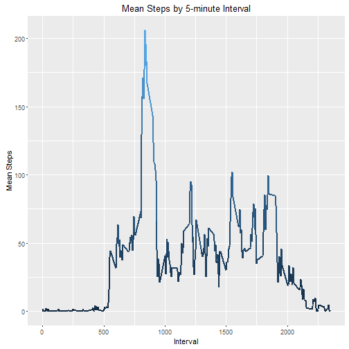
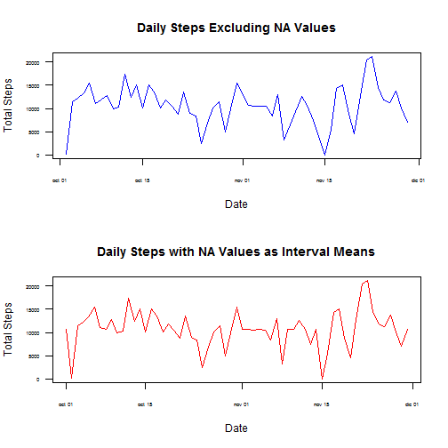
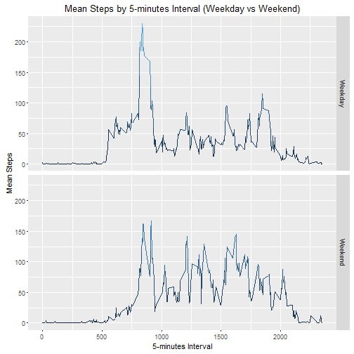

# Reproducible Research: Peer Assessment 1

## Introduction:

This is the 1st peer assessment for the course "Reproducible Research". The student will use a dataset with data form a personal activity monitoring device, which collect data at 5 minute intervals. The data file (csv) can be found in this directory, and includes three variables:

* steps: Step count during the 5-minute interval.
* date: date of measurement (YYYY-MM-DD).
* interval: ID for the 5-minute interval.


## Loading and preprocessing the data

* Loading libraries:


```r
library(dplyr)
library(ggplot2)
```


* Reading CSV file and preprocessing the data frame:


```r
df <- read.csv("activity.csv")
df$date <- as.Date(df$date)
noNA <- !is.na(df$steps)
dfNoNA <- df[noNA, ]
```


## What is mean total number of steps taken per day?
Ignoring missing values for this step.

* Number of steps per day:


```r
gdf <- group_by(dfNoNA, date)
sumSteps <- summarise(gdf, sum(steps))
names(sumSteps) <- c("date", "totalSteps")
```


* Histogram of steps each day

(Note: Barplot show space between columns. Histograms don't. Area is proportional to frequency)

```r
ggplot(sumSteps, aes(date, totalSteps, width=1)) + geom_bar(stat = "identity", fill="darkblue") + labs(title = "Daily steps", x = "Date", y = "Total Steps")
```


* Daily mean number of steps:


```r
mean(sumSteps$totalSteps)
```

```
## [1] 10766.19
```


* Daily median number of steps:


```r
median(sumSteps$totalSteps)
```

```
## [1] 10765
```


## What is the average daily activity pattern?

* Make a time series plot (i.e. type = "l") of the 5-minute interval (x-axis) and the average number of steps taken, averaged across all days (y-axis)


```r
gdf <- group_by(dfNoNA, interval)
intervalMeanSteps <- summarise(gdf, mean(steps))
names(intervalMeanSteps) <- c("interval", "meanSteps")
ggplot(intervalMeanSteps, aes(interval, meanSteps)) + geom_line(lwd=1, aes(col=meanSteps)) + labs(title = "Mean Steps by 5-minute Interval", x = "Interval", y = "Mean Steps") + theme(legend.position="none")
```




* Which 5-minute interval, on average across all the days in the dataset, contains the maximum number of steps?


```r
filter(intervalMeanSteps, meanSteps == max(meanSteps))
```

```
## Source: local data frame [1 x 2]
## 
##   interval meanSteps
##      (int)     (dbl)
## 1      835  206.1698
```


## Imputing missing values

* Calculate and report the total number of missing values in the dataset (i.e. the total number of rows with NAs)


```r
sum(is.na(df))
```

```
## [1] 2304
```


* Devise a strategy for filling in all of the missing values in the dataset. The strategy does not need to be sophisticated. For example, you could use the mean/median for that day, or the mean for that 5-minute interval, etc.

- New data frame where steps NA values are equal to the mean steps for the same 5-minute interval:


* Create a new dataset that is equal to the original dataset but with the missing data filled in.


```r
dfFull <- df
for(ix in seq(nrow(dfFull))) {
	if (is.na(dfFull[ix,1])) {
		myInterval <- dfFull$interval[ix]
		myIntervalMean <- intervalMeanSteps$meanSteps[intervalMeanSteps$interval == myInterval]
		dfFull[ix,1] <- myIntervalMean
	}
}
gdfFull <- group_by(dfFull, date)
sumStepsFull <- summarise(gdfFull, sum(steps))
names(sumStepsFull) <- c("date", "totalSteps")
```


* Make a histogram of the total number of steps taken each day.


```r
ggplot(sumStepsFull, aes(date, totalSteps, width=1)) + geom_bar(stat = "identity", fill="darkblue") + labs(title="Daily Steps with NA Values as Interval Means", x="Date", y="Total Steps")
```


- Calculate and report the mean and median total number of steps taken per day.


```r
mean(sumStepsFull$totalSteps)
```

```
## [1] 10766.19
```

```r
median(sumStepsFull$totalSteps)
```

```
## [1] 10766.19
```


- Do these values differ from the estimates from the first part of the assignment? What is the impact of imputing missing data on the estimates of the total daily number of steps?

 The new values fill some gaps in X axis (omitted in previous plots). Now, each day have reported values, and no day is omitted.
 

```r
par(mfcol = c(2,1))
plot(sumSteps$date, sumSteps$totalSteps, type="l", col="blue", main = "Daily Steps Excluding NA Values", xlab = "Date", ylab = "Total Steps", las=1, cex.axis=0.5)
plot(sumStepsFull$date, sumStepsFull$totalSteps, type="l", col="red", main = "Daily Steps with NA Values as Interval Means", xlab = "Date", ylab = "Total Steps", las=1, cex.axis=0.5)
```




## Are there differences in activity patterns between weekdays and weekends?

* Create a new factor variable in the dataset with two levels - "weekday" and "weekend" indicating whether a given date is a weekday or weekend day.


```r
dfWeek <- mutate(dfFull, Week = format(dfFull$date, "%w"))
dfWeek$Week[dfWeek$Week == 0 | dfWeek$Week == 6] <- "Weekend"
dfWeek$Week[dfWeek$Week %in% 1:5] <- "Weekday"
dfWeek$Week <- as.factor(dfWeek$Week)
```


* Make a panel plot containing a time series plot (i.e. type = "l") of the 5-minute interval (x-axis) and the average number of steps taken, averaged across all weekday days or weekend days (y-axis). See the README file in the GitHub repository to see an example of what this plot should look like using simulated data.


```r
gdfWeek <- group_by(dfWeek, interval, Week)
intervalMeanWeek <- summarise(gdfWeek, mean(steps))
names(intervalMeanWeek) <- c("interval", "week", "meanSteps")
ggplot(intervalMeanWeek, aes(interval, meanSteps)) + geom_line(aes(col=meanSteps)) + facet_grid(week~.) + labs(title = "Mean Steps by 5-minutes Interval (Weekday vs Weekend)", x = "5-minutes Interval", y = "Mean Steps")+ theme(legend.position="none")
```



